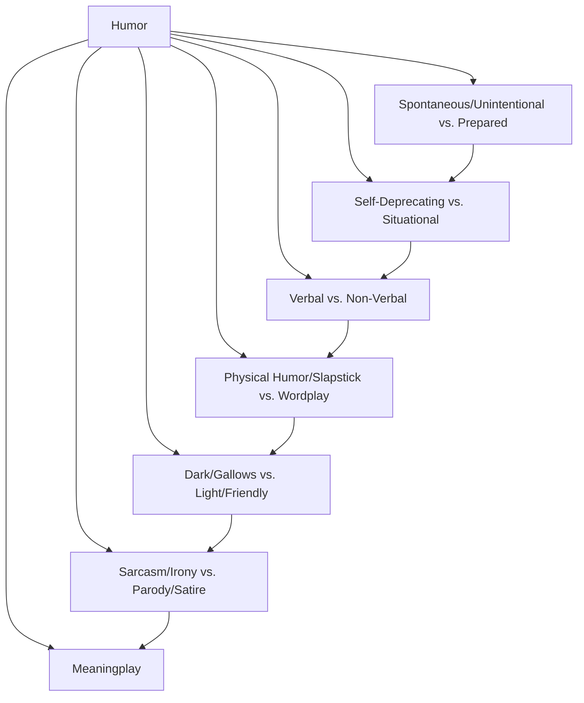

# Introduction

## Research Topic

This research aims to delve into the gender differences associated with humor creation and utilization, shedding light on whether different genders do possess a natural propensity for humor and exploring potential implications in their personal and professional endeavors. By undertaking a comprehensive investigation encompassing multiple disciplines, we seek to challenge existing assumptions, reveal hidden patterns, and contribute to a more nuanced understanding of the relationship between humor, gender, and societal dynamics.

## Motivation for Research

The motivation behind this research is twofold. First, while humor is undoubtedly a universal aspect of human experience, it is critical to acknowledge that it is not experienced or expressed uniformly across all individuals. Cultural, social, and individual factors can significantly influence the creation, appreciation, and utilization of humor. Thus, a deep exploration into gender differences in humor is essential to unravel the intricacies of this human phenomenon.

Secondly, the representation of women in humor-related professions, such as stand-up comedy, comedy writing, and content creation, has historically been comparatively lower than their male counterparts. This disparity raises questions about the underlying factors that may contribute to such imbalances, such as societal biases, stereotypes, and expectations. By examining the relationship between gender and humor, we aim to contribute to ongoing conversations surrounding gender equality, workplace dynamics, and the role of humor in shaping societal perceptions.

## Research Plan

To achieve a comprehensive understanding of the gender differences in humor creation and utilization, this research will employ a multifaceted approach:

1.  **Define Key Concepts**: Understand what constitutes humor and its various forms. This includes understanding the different types of humor (satire, slapstick, dark humor, etc.) and how they are used in different contexts.
2.  **Literature Review**: Look into existing research on gender differences in humor. This could include academic papers, articles, and books that have explored this topic.
3.  **Case Studies**: Identify successful women and men in humor-related professions (comedians, writers, content creators, etc.) and analyze their work for patterns and differences.
4.  **Psychological and Sociological Perspectives**: Explore psychological and sociological theories that might explain any observed differences in humor between genders.
5.  **Bias and Stereotypes**: Examine the role of societal biases and stereotypes in the perception and evaluation of humor.
6.  **Surveys and Studies**: If available, review surveys or studies that have collected data on this topic. This could include audience reactions, professional success metrics, etc.
7.  **Interviews and Anecdotes**: Look for interviews or personal accounts from professionals in the field discussing their experiences with humor and gender.
8.  **Cultural Differences**: Consider the impact of different cultural contexts on humor and gender.
9.  **Conclusion**: Synthesize the information gathered to form a balanced conclusion.

# Chapter 1: Understanding Humor

Humor is a complex and multifaceted phenomenon that plays a crucial role in human communication and social interaction. It can take many forms and serve a variety of purposes, from entertainment and bonding to coping and persuasion.
Humor is a kind of human interaction that often involves the unexpected, incongruity, surprise, and amusement. It's has the power to evoke laughter and provide amusement. Here are some key aspects of humor:

1.  **Incongruity**: Humor often involves presenting things that are incongruous or unexpected. This could be a surprising punchline in a joke, a humorous twist in a story, or a funny image that doesn't match our expectations.
2.  **Social Function**: Humor often serves a social function. It can be a way of bonding with others, breaking the ice in social situations, or navigating difficult topics. It can also be used to challenge social norms or critique societal issues.
3.  **Cognitive Process**: Humor involves a cognitive process where we recognize the humor in a situation. This can involve understanding a joke, recognizing the absurdity in a situation, or appreciating the wit in a clever remark.
4.  **Emotional Response**: Humor typically elicits an emotional response, often in the form of laughter or amusement. This can provide a sense of joy, relief, or even a release of tension.
5.  **Subjectivity**: Humor is highly subjective. What one person finds funny, another might not. This can depend on a range of factors, including personal taste, cultural background, and context.

In the context of our exploration, we're interested in how humor is created and used by individuals, both in their personal lives and in professional settings such as writing, comedy, and content creation. 
In this chapter, we will explore the different types of humor and provide examples to illustrate each one.

## Types of Humor

Humor can be broadly categorized into several types, each with its own characteristics and uses. Here is a visual representation of the different types of humor:

Let's delve into each type:

1.  **Spontaneous/Unintentional vs. Prepared Humor**: Spontaneous humor arises naturally from situations, often without premeditation, while prepared humor is intentionally constructed, such as jokes or comedic scripts.
    -   A spontaneous quip might be made when someone accidentally spills their drink at a party: "*I always said I wanted to make a splash at parties!*"
    -   A prepared joke might be part of a stand-up comedian's routine.
      "*Stand-up is a lot like sex. There's a lot of crying involved and I get paid to do it.*"
2.  **Self-Deprecating vs. Situational Humor**: Self-deprecating humor involves making oneself the butt of the joke, often to break the ice or make others comfortable, while situational humor arises from the absurd or amusing nature of a specific situation.
    -   A comedian making fun of their own bad luck or qualities is an example of self-deprecating humor.
      Woody Allen: Known for his self-deprecating style, Woody Allen often incorporates it into his stand-up routines and films. One of his famous lines is, "*I'm not afraid of death; I just don't want to be there when it happens.*"
    -   A funny misunderstanding in a sitcom is an example of situational humor.
      A scene from "How I Met Your Mother": 
      *The gang is at MacLaren's Pub, and Ted is telling a long, exaggerated story about something trivial. 
      Ted: And then, I kid you not, the cashier asks me if I want a bag for my gum! 
      Marshall: Wow, Ted. I think that's what they call a "life-changing experience.*
3.  **Verbal vs. Non-Verbal Humor**: Verbal humor relies on language, such as puns, wordplay, or witty remarks, while non-verbal humor doesn't rely on language and includes physical comedy or visual gags.
    -   A classic pun is an example of verbal humor.
	   “*'Mine is a long and a sad tale!' said the Mouse, turning to Alice, and sighing. 'It is a long tail, certainly', said Alice, looking down with wonder at the Mouse’s tail; 'but why do you call it sad?'*”
    -   A character stepping on a rake in a silent movie is an example of non-verbal humor.
4.  **Physical Humor/Slapstick vs. Wordplay**: Physical humor involves exaggerated physical activity which exceeds the boundaries of normal physical comedy, while wordplay humor plays on words, such as puns, malapropisms, and double entendre.
    -   A character slipping on a banana peel in a comedy movie is an example of physical humor.
	    Some other examples include *falling, getting hit, mime performance, physical comedy in cartoons, over-the-top reactions, handshake prank, air instrument performance and so on.*
    -   A clever play on words about anti-gravity is an example of wordplay.
	    "*I'm reading a book about anti-gravity. It's impossible to put down!*"
5.  **Dark/Gallows vs. Light/Friendly Humor**: Dark humor makes light of serious, often morbid or taboo, subjects, while light humor is easy-going, non-offensive, and suitable for all audiences.
    -   A satirical comment on democracy is an example of dark humor.
	    "*Yeah, democracy is such a terrible thing. I mean, who wants to be alive and have the freedom to express their opinions, participate in decision-making, and enjoy basic rights when you can just be six feet under, right?*"
    -   A light-hearted joke about firm's secrets is an example of light humor.
6.  **Sarcasm/Irony vs. Parody/Satire**: Sarcasm and irony involve saying one thing but meaning another, often to criticize or mock, while parody and satire involve imitating and exaggerating others' work or style to critique or humorously comment on them.
    -   A sarcastic comment about someone's punctuality when they're late is an example of sarcasm/irony.
    -   A comedic sketch mocking a popular movie is an example of parody/satire.

And all of them do use:

## Meaningplay

Humor, in its essence, involves a "play" or manipulation of meanings. This "meaningplay" can take various forms and is integral to the humor process. It's the cognitive gymnastics our minds perform when we process a joke, a pun, or a funny situation. Here are some ways in which "meaningplay" manifests in humor:

1.  **Ambiguity**: Humor often exploits the ambiguity inherent in language. A word or phrase with multiple meanings can lead to unexpected and humorous interpretations. For example, consider the classic Groucho Marx joke: "Time flies like an arrow; fruit flies like a banana." The humor here arises from the double meaning of "flies."
2.  **Misinterpretation**: Deliberate misinterpretation of a statement or situation can also lead to humor. This is often seen in comedic TV shows and films where characters misunderstand phrases or situations, leading to humorous outcomes.
3.  **Absurdity**: Humor can emerge from the absurd or nonsensical interpretation of a situation. This form of humor often involves creating a stark contrast between the situation and the norm, leading to a humorous disconnect.
4.  **Incongruity**: Incongruity, or the juxtaposition of unexpected elements, is a key aspect of humor. This involves presenting things in a way that defies our expectations, leading to a humorous surprise.

In essence, all humor involves a form of "meaningplay." It's the unexpected twist, the surprising interpretation, or the clever manipulation of language that tickles our cognitive faculties and elicits laughter. This understanding of humor underscores its subjective nature - what one person finds humorous, another might not, largely due to differences in how they play with and interpret meanings.

Understanding these types and concepts of humor can enhance our appreciation of humor in different contexts and help us become more effective communicators. In the next chapter, we will explore the role of humor in different aspects of life, including personal relationships, work, and entertainment.